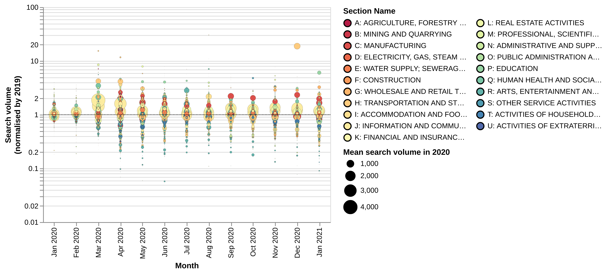
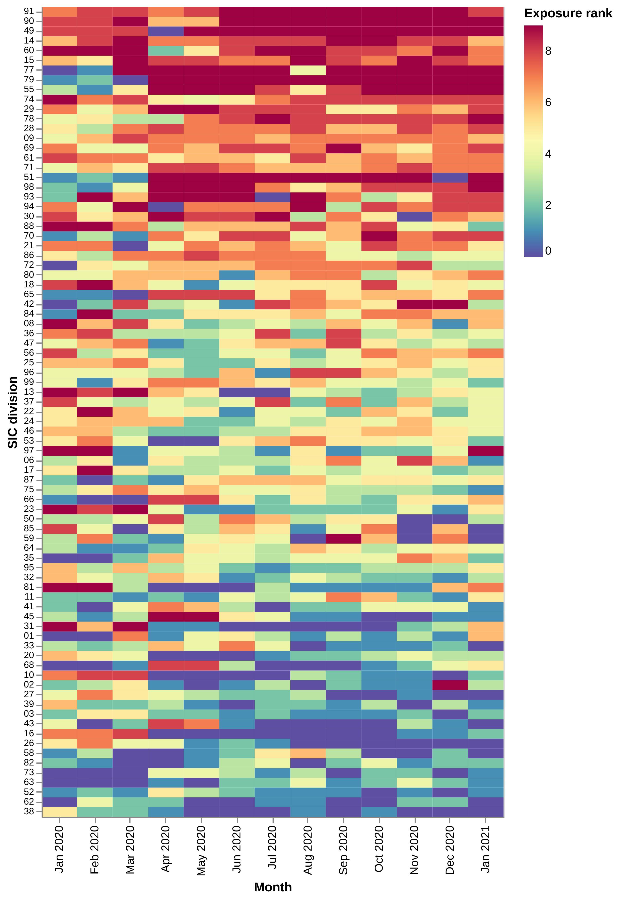

# 3. Data sources and methodology

This section describes the data we have collected and the methods we have deployed in its analysis in order to answer the following questions:

1. What is the role of business website and search data in generating new indicators about economic exposure to Covid-19 that add to what evidence is available from existing official and administrative sources? Here we are in particular interested in the technical feasibility of various approaches to data collection and processing, and on the quality of the resulting data in terms of coverage and accuracy.
2. What do the resulting indicators tell us about the impact of Covid-19 on Scotland? Here we are particularly interested in identifying what local economies / sector firms / firms in Scotland are most exposed to Covid-19, what are their opportunities for diversification and implications for policy.

We begin with a high level summary of our approach, followed by a detailed description of each of the data sources we have collected, how we have processed and their validation through triangulation with other sources and previous studies. All the code we have developed for data collection and analysis is available from [this GitHub repository](https://github.com/nestauk/sg_covid_impact/). 

## 1. The logic of our approach

The starting point for our analysis is that business websites contain information that may be relevant for the analysis of the economic impact of Covid-19. This includes descriptions of what businesses do which may help us to quantify their exposure / opportunities to diversify from Covid-19 and Covid-19 notices where businesses describe how they are adapting in response to the pandemic. It is possible to deploy machine learning and natural language processing methods in order to extract information from these unstructured sources.

At the same time, business websites are hard to use for longitudinal analyses because they are not updated following a regular schedule, they lack policy-relevant information about employment and turnover, and suffer from potential biases in their sectoral and geographical coverage.

Our prior is that some of these limitations can be addressed by combining business website data with other sources:

1. We can use Google Search trend data queried with the names of products and services that businesses sell (extracted from their business descriptions) to build a longitudinal picture of exposure to Covid-19. We can also extract social media profiles from business websites and use them as a seed to collect their social media feeds in order to generate more regularly updated measures of their activity. 
2. We can combine measures of sectoral exposure to Covid-19 based on the text from business websites with official data to estimate the share of workorce in local economies that is exposed to Covid-19. This is similar to the approach in [@del2020supply, @mcintyre2020vulnerability, @enenkel2020cities] but with the advantage of relying on data-driven measures of sectoral exposure to Covid-19 derived from search trends, instead of ex-ante expert assessments or irregularly, low-granularity sector exposure data.
3. We can use the text in business websites to generate maps of "sectoral proximity" helping us to identify opportunities for industrial diversification away from markets that are highly exposed to Covid-19. We can use the results to rank the position of different sectors in terms of their ability to diversify away from Covid-19, and combine this with official data to measure the extent to which different local economies have large shares of their workforce employed in sectors that are highly exposed to Covid-19 and have limited opportunities to diversify away from it.
4. We can combine business website information with the business registry in order to track business outcomes (such as business failure) and explore opportunities to "nowcast" them using their text and Covid-19 notices as predictors (the idea being that there may be some signal about a business' outcomes in the text that describes current behaviours in response to the pandemic). 

[@Fig:pipeline] summarises our approach.

{#fig:pipeline}

## 2. Data sources

### a. Glass.ai

The core dataset for our analysis has been obtained from [Glass](https://www.glass.ai/), a startup that uses machine learning to collect and analyse business website data at scale. More specifically, Glass begin from the universe of UK websites in web domain registers, identifies those that are highly likely to belong to a business, and extracts relevant information about them including their description, postcodes and sector based on an industrial taxonomy developed by LinkedIn. In this project, we work with information about 1.8 million business websites (which according to Glass account for 90% of UK business websites) collected in May and June 2020. 

The main advantage of Glass data that makes it relevant for our project is that it includes business descriptions that can be used to understand their economic activities at a higher level of resolution than is possible using industrial taxonomies. The fact that businesses generally use their websites to promote goods and services to consumers mean that we would expect their terminology to be suitable for querying with Google Search Trends, the data source that we will use to proxy consumer interests for the goods and services provided by different industries and its evolution.

In addition to business metadata, Glass also started collecting Covid-19 notices at the beginning of the pandemic by searching for passages of text in a business' website that reference terms such as "Covid", "Coronavirus", "Government recommendation", "lockdown" etc.
This captures notices such as,

> "COVID-19: In light of the COVID-19 pandemic, we're only doing one-to-one lessons via Zoom or Skype. Please see our prices or contact us for more information. All the best, Dave and the team."

Glass have provided between 210K-220K such notices for each of May, June, and July 2020 which we have used to assess whether periodic collection of notices can help to assess the impact of Covid-19 in Scotland, by identifying sectors and regions which are posting notices that are indicative of exposure to Covid, such as only being able to conduct lessons online.

The SIC code (sector) of a notice is obtained by linking Glass to Companies house ([@sec:jacchammer]), and regions can be obtained either from the address data scraped from a business' website or from the trading address listed in Companies house.

### b. Google Search Trends

Google Search Trends is a Google service that provides aggregate information about the level of Google Search user interest in different search terms, which could be understood as a proxy for the subjects (including products and services) that those terms refer to. Google Search Trends has been extensively used in scholarly research. Some notable examples include its use to nowcast economic indicators [@choi2012predicting], to measure the impact of racial animus in US presidential elections [@stephens2014cost] and to forecast the incidence of influenza in the USA [@dugas2013influenza] \(this application also demonstrated its flaws as a data source when changes in user behaviour degraded the performance of searching for flu-related terms as a predictor of flu [@lazer2014parable]). More recently, journalists have used Google Search Trends to [measure Covid-19 impact on consumer lifestyle](https://www.economist.com/graphic-detail/2020/08/08/covid-19-seems-to-have-changed-lifestyles-for-good).

We collect search volume data for a set of keywords extracted from business websites using the procedure described in Section 3.b. In order to query the Google Search API we rely on [GTAB](https://github.com/epfl-dlab/GoogleTrendsAnchorBank) (Google Search Trends Anchorbank), a Python package that generates, for a selected period, a "bank" of anchor terms with a range of popularities that is then used to calibrate search volumes for all keywords of interest subsequently queried according to a common scale [@west2020calibration]. We extract search trend data for UK searches in the period between 1 Jan 2019 and 1 February 2021 (we will use the 2019 data to normalise search volumes post-pandemic). 

### c. Twitter {#sec:twitter_method}

The twitter accounts Scottish businesses are not provided by Glass,
 therefore we built a pipeline to scrape the websites of Scottish businesses,
 find references to twitter accounts,
 and scrape the tweets of these accounts.

The scraper scrapes the main page of each business website,
 finds additional internal links
  and applies a simple heuristic to choose which links are the "best" $n$ ($n=4$),
 and then scrapes these links too.
References to twitter handles or links to twitter are captured and the frequency of each counted aggregated for each website.
Tweets that are not retweets are collected from January 2019 up to and including November 2020 (the date of data collection) - 
 the full history of a user's tweets would be prohibitively slow 
 due to the Twitter API ratelimit .
Furthermore, for many accounts the full history would not be available as the Twitter API only allows retrieveal of the 3,200 most recent tweets.
Collection from January 2019 is a pragmatic balance between tweet availability; collection speed; and the utility of having a previous year's tweets to normalise activity against.
Once tweets are collected, one must determine which of the twitter accounts mentioned on a businesses' website is the best match.
Our matching heuristic for this is as follows:

- Discard any twitter accounts mentioned more than 5 times across all websites
- If there is only one match, consider that a match (high recall, low precision).
- If one of the candidate twitter accounts has a string similarity score to the company name of over 70% then choose as a match.
- If the twitter profile of one of the candidate twitter accounts, includes a link to the business website then choose as a match.

An informal verification suggests that this heuristic performs well; however taking this analysis beyond the pilot stage would require improvement of the heuristic when there is only one match.
The current heuristic favours high recall in this case, though a better compromise between precision and recall no doubt exists.

### d. Miscellaneous secondary sources

#### Official sources

Our analysis makes extensive use of official sources obtained from Nomis, a website offering access to open labour market statistics in the UK. We collect:

* [Business Register Employment Survey (BRES)](https://www.nomisweb.co.uk/sources/bres) data about Local Authority District levels of employment at the SIC-2 (Division) level for the most recent year available (2019).

* [Claimant count](https://www.nomisweb.co.uk/sources/cc) data including information about people claiming Jobseekers Allowance or Universal Credit at the Local Authority District level. We collect monthly data on claimant count rates (claimant numbers normalised by working age population) for 2019 and 2020 and normalise monthly 2020 values by their 2019 equivalent in order to capture changes linked to Covid-19.

* [Annual Population Survey](https://www.nomisweb.co.uk/sources/aps) data about employment and Economic Activity rates and percentages of the population with tertiary education and no education at the Local Authority District level from the December 2020.

* [Annual Survey of Hours and Earnings](https://www.nomisweb.co.uk/sources/ashe) (ASHE) data about median annual gross income.

#### Other validation sources

We have collected additional data from a number of secondary sources which we use to triangulate our trends results. They include:

* [Google community mobility data](https://www.google.com/covid19/mobility/) which report disaggregated information about phone user mobility across different categories of places such as retail and recreation, groceries and pharmacies, parks, transit stations, workplaces, and residential.
* [Covid incidence data](https://coronavirus.data.gov.uk/) including new deaths attributed to Covid-19 within 28 days of diagnosis which we obtain from `data.gov.uk`.

### e. Sources of data on Business failures

Reliable data on business failures would allow
 both validation of our exposure indicators
 and the training of a predictive model which could identify businesses most at risk of failure in the future.
The more timely and granular business failure data is, the better our indicators can be validated and used to predict businesses at risk of failure in the future.
Granularity is important because it determines the level at which decisions can be made.
Timeliness is important because it allows us to detect drift in the validity of indicators (as the pandemic and the response to it evolve) and increases the data available to validate and train models against.

We identified the following potential sources of business failure data:

- Insolvency service - statistics on company and individual insolvencies
- Business Impact of Coronavirus Survey (BICS) - a fortnightly survey of business on how their turnover, resilience etc. have been impacted
- HMRC job retention data - data about the uptake of the job retention (furlough) scheme
- Companies House business registry - containing data on actively trading companies and newly dissolved companies

Our assessment of these data sources revealed two primary problems.
Firstly, there is a sparsity of business failure datasets that are timely and/or granular.
Secondly, and more problematic, business failures (across many measures) have been suppressed by policy interventions such as the furlough scheme, with the levels of business failures in 2020 being lower than 2019.
Given these datasets do not act as a "ground truth" of business failures, we cannot use them in the way originally intentioned.

## 3. Data processing

### a. Matching Glass with Companies House {#sec:jacchammer}

In order to obtain SIC codes for business websites,
 and to a lesser extent to obtain a secondary source of address data,
 we match the Glass dataset to Companies house using the monthly data snapshots for
 May, June, and July 2020 -
 available at the time from the 
 [Companies house website](http://download.companieshouse.gov.uk/en_output.html).

The matching methodology matches the names of companies in Companies House with the names extracted by Glass from business websites.
Naively comparing the similarity of all combinations of names is computationally infeasible.
We therefore use a combination of two approximate methods that identify a subset of Companies House names that are sufficiently similar to each Glass company name.
Firstly, we use Locality Sensitive Hashing (with the Jaccard similarity of k-shingles) -
 a method originally used by search engines to detect near-duplicate web pages to improve their search results [@LSH] - this captures small spelling/grammatical variations.
In addition, we use the cosine similarity of the TF-IDF score of names (which can be efficiently computed and queried for the top $n$ most similar terms).
 This excels at capturing word ordering differences and information about the frequency of words across the corpus of company names.
After identifying these sets of similar names we can apply the exact similarity measures that were computationally infeasible to naively apply across the whole dataset.
Each Glass organisation only appears once but each Companies House organisation may appear multiple times.
This matching is not exact and problems do exist.
For example, due to the nature of Companies House,
 some matches may be to the wrong part of a conglomerate company
 which may have a different SIC designation.
We only consider matches with a similarity score of 70% or higher - which we empirically determined as a sensible threshold.

### b. Creating an industrial vocabulary

In order to query Google Trends, we need a list of keywords related to the economic activities of different industries. We extract this "industry vocabulary" from Glass business descriptions. Our strategy is to aggregate the descriptions of all businesses in the same SIC division, tokenise then (extract individual works and commonly occurring combinations of words), count them and normalise these counts by the word distribution over the whole corpus. Having done this, we remove duplicate words (e.g. plurals) and focus, for each division on the top 25 / those that have a salience score above one (ie are overrepresented in the division) after removing tokens with less than 75 occurrences in each division to avoid low-frequency noisy terms.

[@Tbl:examples] presents examples of industrial vocabularies randomly extracted from our list of SIC divisions. It shows that in general the approach we have taken appears to work well and generates intuitive vocabularies for various divisions, although in some cases such as with division 21 (pharmaceuticals), it generates very few keywords, potentially reducing the robustness of our search analysis for those sectors.

<!---TODO: calculate % employment accounted by industries with short industry vocabularies - it will be low.
--> 

|Division									|Keywords|
|------------------------------------|----------------------|
|41: Construction of buildings      	|homes building housing apartments construction builders finish extensions residential projects new\_build decorating architects planning_permission developments      |
|38: Waste collection, treatment and disposal activities| materials recovery recycling waste clearance scrap environmental skip\_hire asbestos skips metals disposal waste\_disposal scrap\_metal waste\_recycling waste\_management landfill |
|58: Publishing activities 				|news games books press magazine journal editor fiction literature titles publishing articles writers readers authors|
|21: Manufacture of basic pharmaceutical products and pharmaceutical preparations | health business also|
|80: Security and investigation activities | police security cctv sia investigation guards alarms locksmith surveillance security\_systems access_control fire\_security security\_guards |
|25: Manufacture of fabricated metal products, except machinery and equipment | metal steel engineering wire gates stainless\_steel aluminium components assembly welding precision cnc aerospace fabrication sheet\_metal | 

Table: Industrial vocabulary examples by SIC division {#tbl:examples}

### c. Estimating sectoral exposure {#sec:exposure}

We extract normalised search volumes for keywords in industry vocabularies from Google Search Trends and use the results to produce measures of industrial exposure to Covid-19. In order to do this we:

1. Take weekly search volumes by keyword to generate monthly averages.
2. Normalise the search volume of each keyword by its salience in a SIC division. This means that keywords that are more salient for the industry will have a stronger weight when estimating its exposure to Covid-19 than terms that are less salient (ie occur more frequently in other divisions). For example, in Division 25 in [@tbl:examples] `metal` will be more salient (and have more weight when estimating that division's exposure to Covid-19) than a generic term such as `components`.
3. Normalise search volumes by the total volume of searches in the industry vocabulary. This means that keywords that account for a larger proportion of all searches in an industry vocabulary will have a bigger weight in determining its exposure to Covid-19.
4. Rescale 2020 and 2021 normalised keyword search volumes by the normalised search volumes in equivalent 2019 months in order to capture deviations from a pre-Covid-19 baseline and account for seasonality in searches (ie the fact that people are more likely to search for information about air transport when they are planning their holidays at the beginning of the year, or for information about sports when a tournament starts).
5. Calculate the average of 2019-rescaled keyword search volumes in a division weighted by the share of division search accounted by that keyword. 
6. The procedure above yields a single monthly score for each SIC division capturing the extent to which search trends about keywords related to it are higher or lower than the pre-Covid 19 average. We change the sign of the score and quantize this series into deciles: we label sectors in the highest deciles as "highly exposed to Covid-19" (ie the weighted search volumes for their queries are much lower than the pre-Covid-19 baseline) and generally focus on them through our analysis.

### d. Calculating sectoral diversification options

We use similarity between business website descriptions in order to calculate similarities between industries, which we interpret as a proxy for diversification opportunities: those sectors that are "close" to each other within the industry space that we build are more likely to be able to diversify into each other's activities (this idea is based on the "Principle of Relatedness" which economic geographers have shown shapes the evolution of local economies [@hidalgo2018principle]).

In order to calculate similarities between industries we train a machine learning model that predicts the SIC divisions for companies in the Glass-Companies House matched dataset using their descriptions after standard pre-processing. We use grid-search to select the model type and parameters that yield the best predictive performance, which in this case is a regularised logistic regresssion. 

{#fig:model}

[@Fig:model] summarises the predictive performance of the model for different SIC divisions. The model includes the actual label in the top five predictions it makes 72% of the times, and in the top ten 84%. This feels reasonable given the degree of noise in company descriptions and low level of informativeness in some SIC labels such as "Other activities not elsewhere classified" and the possibility that some companies are mislabelled in their sectors but there is still room for improvement in future work. 

Since our model has been trained using a one vs rest classification regime that generates a probability score for each business and SIC division, we can use the resulting vector to calculate "industry co-occurrences" in a company (ie companies that are predicted to belong to more than one sector based on the machine learning model). 

We create a network (the "industry space") where the nodes are SIC divisions and the edges are co-occurrences in business descriptions (the degree or thickness of these edges depends on the number of co-occurrences) and arrange it using a force-directed algorithm that bundles more closely those nodes which are similar to each other. In order to simplify our visualisations, we will use a maximum spanning tree algorithm that preserves those edges that create a fully connected network with the highest-degree edges and add to it the top 100 weighted-edges which are not part of the maximum spanning treee (this is the same approach that [@hidalgo2009building] use to visualise the product space that they create using trade data with the difference that their measures of similarity are based on product co-occurrence in a country, while ours is based om sector co-occurrence in a firm description). 

In order to estimate a sector's diversification options to reduce exposure to Covid-19 we will calculate, on a monthly basis, and focusing on sectors at high levels of exposure based on the method outlined below, their average distance through the network to sectors with low levels of exposure to Covid-19. We quantize these into quartiles and label as "sectors with low diversification options from Covid-19" those industries above the median in their average distance to sectors with low levels of exposure to Covid-19.

### e. Topic modelling Covid notices

#### Pre-processing

To turn the notice text into data we can mathematically analyse,
 we process the notices into tri-grams (groups of up to three words)
 performing filtering 
 and lemmatising (grouping together inflected forms of a word) as we go.

For example the following notice, 

> "Leek Town Council has shown its support for a vital element in the town's response to the Covid 19 crisis by awarding a grant of £1000 to the Haregate Community Centre. Although the centre is now closed to its usual community groups, it has Read More..."

Becomes the following set of tokens

`['leek', 'town_council', 'has_shown', 'support', 'vital', 'element', 'town', 'response_to', 'covid_crisis', 'awarding', 'grant', 'community_centre', 'although', 'centre', 'closed', 'usual', 'community_groups', 'read_more']`

#### Model {#sec:topsbm}

By considering our documents (business notices) as being a mixture of topics -
 a weighted mixture of words -
  we can learn topics in an unsupervised manner
  from the likelihood of word co-occurrences within our documents.
This approach enables us to analyse
 both the extent to which topics co-relate with factors such as the sector and location of notices,
 and identify whether any topics correlate with measures of exposure.

We train a TopSBM [@topSBM] topic model on our pre-processed collection of Covid notices
 from Scottish business websites.
This approach confers multiple advantages
 over the more traditional Latent Dirichlet Allocation (LDA) [@LDA] frequently used in the literature
 such as automatically selecting the number of topics;
 yielding a hierarchy of topics;
 and permitting a more heterogeneous topic mixture than is permitted by LDA.

## 4. Descriptive analysis and validation

In this section we present some descriptive results that we have undertaken in order to validate and sense-check our data and assess its limitations. 

### a. Glass coverage

We have compared the industrial and geographic distribution of the Glass data with Companies House. In general we find a strong level of concordance between both: the pearson correlation coefficient $\rho$ between Glass and Companies House sectoral and geographical distributions for Scottish companies are 0.91 and 0.99 respectively. 

In [@fig:sector_val] we present the differences between shares of sectoral activity accounted by SIC division in Glass and Companies House. Positive values capture situations where a division is overrepresented in Glass data  ([**interactive version here**](https://scotland-figures.s3.eu-west-2.amazonaws.com/glass_sector_validation.html)).

{#fig:sector_val}

The figure shows that *Primary sectors* and *Transportation* tend to be underrepresented in the Glass data while *Manufacturing*, *Administrative services*, *Health*, the *Arts* and *Professional Activities* tend to be overrepresented. *Activities of Membership Organisations* is an outlier in terms of representation probably because of the presence of some charity data in Glass.

In [@fig:place_val] we perform a similar analysis but comparing the geographical representation of different Local Authority Districts in Glass and Companies House ([**interactive version here**](https://scotland-figures.s3.eu-west-2.amazonaws.com/glass_place_validation.html)). 

{#fig:place_val}

We see that council areas in Highlands and Islands tend, in general, to be overrepresented in the Glass data while Local Authorities around Aberdeen and the central belt - in particular Glasgow City - are underrepresented. We dig further into the potential reasons for this in [@fig:sector_place_val], where we present, in the left panel, the over or underrepresentations of SIC divisions (horizontal axis) in each Local Authority District (vertical axis)  ([**interactive version here**](https://scotland-figures.s3.eu-west-2.amazonaws.com/glass_sector_place_validation.html)). The left panel shows the correlation between the sectoral distribution of activity in Glass and Companies House by Local Authority. For example, in the case of Glasgow City, the low correlation between Glass and Companies House sectoral distributions seems to be driven by an underrepresentation of *Postal and Courier* activities in Glass and an overrepresentation of various *professional* and *administrative services*. One question that we do not consider here is to which extent are these divergences explained by limitations in Glass coverage or by geographical divergences in the levels of website adoption.

{#fig:sector_place_val}

We conclude by noting that although at a high level, the Scottish sectoral and geographical distributions of activity in Glass and Companies House are similar, there remain some important differences for particular industries and locations that create challenges for using it directly in order to generate indicators comparing the situation in different locations. This is one of the reasons why in one of our main streams of analysis we use Glass to generate industry vocabularies which we then scale to local authorities using representative BRES data instead of directly relying on Glass micro-data whose biases are likely to become amplified when focusing on geography-sector cells with small sample sizes.

### b. Descriptive results

Having explored Glass' geographical coverage we turn our attention to the evolution of search volumes for different keywords and of our estimates of sector exposure to Covid-19. 

This has the goal of sense-checking whether the resulting trends are consistent with our intuitions of the evolution of the pandemic and its impact on consumer interest for the goods and services supplied by different industries.

#### Keyword trends

[@Fig:keyword_trends] shows the evolution of normalised search volumes since January 2020 (we use a logarithmic scale in the Y axis to reduce the impact of outliers). The size of the points represents the volume of search and the color the SIC section they are related to (we note that we have not normalised keyword volumes by industry salience / overall volume of search in this chart). 

{#fig:keyword_trends}

The chart, which can be explored [**here**](https://scotland-figures.s3.eu-west-2.amazonaws.com/keyword_trends.html) shows that at the beginning of the pandemic terms such as *symptoms* and *news* attracted unusual (versus the pre-Covid-19 baseline) levels of attention. By contrast, terms related to travelling, sports and social consumption such as *airport*, *bus*, *football* or restaurant experience a drop compared to the same month in the previous year. Certain products and services that anecdotally have experienced an increase in demand during the pandemic such as *bread*, *video* or *bicycles* also see an increase. Later in the year, we note high volumes of normalised searching for *tests* while interest in cultural activities such as *cinema*, *theatre* or *museum* remain depressed. We note that a blip of interest in the term *global* in December which might be spurious (we expect that our averaging and weighting methodology should make our sectoral exposure estimates robust to this kind of disturbance in search activity). 

#### Sector exposure trends

[@Fig:sector_exposures] presents monthly changes in sectoral exposure to Covid-19. Every row in the Y axis is a SIC division (not all of them are labelled - the chart can be explored interactively [**here**](https://scotland-figures.s3.eu-west-2.amazonaws.com/sector_exposures.html)). The colour of each cell represents the position of a SIC division in the ranking of exposure to Covid-19. Red colours indicate high levels of exposure (ie low volumes of search for keywords about the industry in relation to the baseline) and blue colours indicate the opposite. 

{#fig:sector_exposures}

The results are consistent with our understanding of the sectoral impact of the pandemic based on measures of GDP mentioned in the literature review: *Libraries*, *Creative arts*, *Air transport*, *Accommodation* appear among the most highly exposed sectors on a consistent basis while *Computer programming*, *Waste removal*,  *Information service activities* and *repair and installation of equipment* appear amongst the least exposed. It is interesting that our methodology appears to capture temporal shifts in exposure to Covid-19 - for example *Food and beverage services* appear less exposed during the summer when some social distancing measures where lifted. *Construction* and *Real Estate* appear highly exposed during the first lockdown in April and May but less so since. In summary, our estimates of sectoral exposure to Covid-19 appear to capture our intuitions about what sectors have been impacted by the pandemic. 

### c. Correlation betweeen sectoral exposures and other measures of Covid-19 impact

As an additional validation step, we have correlated time-series of search interest on products and services related to different industries aggregated at the SIC section level with other trend data indicative of the severity of Covid-19 and its impact on individual behaviours proxied via Google Footfall data. We present the results in [@fig:add_val], where every facet presents the correlation coefficients between search trends for keywords in an industry and our additional validation measures.

{#fig:add_val}

The chart shows that volumes of interest in sectors requiring high levels of physical proximity and social interaction such as *Construction*, *Arts and Entertainment*, *Transport* or *Real Estate* are negatively correlated with proxies for the impact of the severity of the pandemic (and allied social distancing and lock down measures). They are also negatively correlated with measures of consumer activity in residential areas based on mobility data (again a proxy for the lockdown) and positively correlated with measures of mobility in retail, workplace and transit areas. 

The sign of these correlation are reversed for *Information and Communication* activities and *Manufacturing* where consumption is less dependent on physical proximity. 

### d. Twitter coverage

We have compared the industrial and geographic distribution of Tweets with Glass.

Over-representation factor of each Council area's share of tweets when compared to their presence in the Glass data
<!-- TODO: do this by user too -->

[@Fig:tweets_laua_representivity] shows how under or over-represented a Council area's share of tweets are when compared to Glass.
We see that Edinburgh, Glasgow, and other urban areas are over-represented compared to rural areas which tend to be under-represented.

Over-representation factor of each SIC section's share of tweets when compared to their presence in the Glass data
<!-- TODO: do this by user too -->

[@Fig:tweets_section_representivity] shows how under or over-represented a SIC section's share of tweets are when compared to Glass. 
Perhaps as expected, *Accomodation and Food Services* are very over-represented.
*Information and Communication*, and *Professional, Scientific, And Technical Activities* are under-represented likely due to their over-representation in the Glass dataset.
