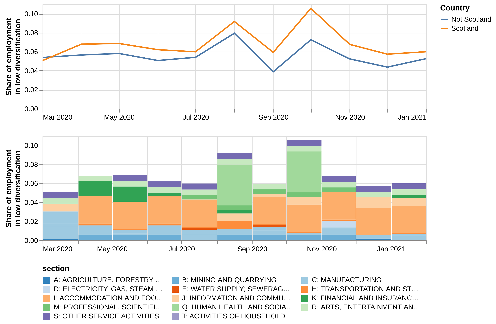
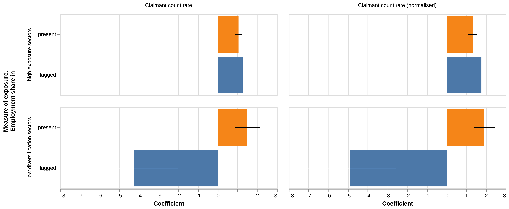

# 3. Results

This section presents the results of our analysis split into two sections. 

Section 1 focuses on the aggregate indicators stream of analysis where we use business descriptions from Glass and Google Search trends to generate sector rankings of exposure and opportunities for diversification from Covid-19 which we subsequently combine with official data in order to generate local estimates of share of the workforce exposed to and able to diversify from Covid-19.

Section 2 explores various avenues to generate firm-level measures of exposure / adaptation to Covid-19 through analyses of Covid-19 notices posted in business websites, by linking company websites to regularly updated social media feeds, and by looking for secondary sources of information about business outcomes (such as company dissolutions in Companies House) which could help us go from evidence about "exposure" to Covid-19 to objective measures of impact and its drivers.

## 1. Aggregate results

### a. Exposure to Covid-19

As discussed in the methodology, we have combined information from business websites and Google Search Trends in order to produce monthly sectoral rankings of exposure to Covid-19: sectors with very low levels of consumer interest compared to a pre-Covid-19 baseline are labelled as "high exposed". 

#### National exposure

[@fig:nat_evol] presents the evolution and composition of employment in sectors highly exposed to Covid-19 (decile 8 and above of exposure) between March 2020 and January 2021.

* The top panel presents aggregate shares of employment in Scotland and in the rest of the UK. It shows similar patterns of economic exposure to Covid-19 in terms of levels and evolution. We see spikes of exposure around the three main Covid-19 waves and associated lockdowns / policy restriction (March, October and Christmas 2020).
* The bottom panel presents the shares of employment in Scotland exposed to Covid-19 accounted for by different SIC sections (the [interactive version](link here) allows a more finely grained exploration at the SIC divisionslevel). The charts shows important changes in the composition of workforces exposed to the pandemic at different points: during the first lockdown a significant share of the exposed workforce was in *Health activities* (differently from subsequent lockdowns, specialist health services such as dentists etc. were forced to close over this period) and in *Construction*. In subsequent phases of the pandemic other sectors such as *Accommodation*, *Employment activities* and *Social work* as well as some professional services such as *Legal and accounting* account for a larger share of the workforce exposed to Covid-19.

{#fig:nat_evol}

In chart [@fig:nat_comp] we consider the industrial composition of the Scottish economy together with levels of exposure to Covid-19 in different sectors ([interactive version here](link)). 

* The left panel focuses on the shares of employment in different divisions (ranked by their position in the SIC taxonomy) coloured by their level of exposure to Covid-19 in January 2021 (with red referring to high levels of exposure). It shows -unsurpringinsly - that the majority of employment is in Services, and that there is substantial variation in the level of exposure to Covid-19 (in January) across big employer sectors: Industries such as *Education* and *Retail trade* show low levels of exposure, while others such as *Accommodation* and *Food and Service activities* are highly exposed. *Human Health*, *Social Work* and *Public administration* sit somewhere in the middle, suggesting steady demand for their services despite the pandemic and social distancing. 

* The right panel shows the relative levels of specialisation measured with location quotients in those same divisions (we use a logarithmic scale to reduce the impact on the visualisation of primary sectors such as oil where Scotland has very high levels of specialisation). Our goal is to explore the extent to which sectors where Scotland has a revealed comparative advantage are exposed to Covid-19. 

  * The chart shows that most primary sectors that Scotland has a strong specialisation on such as *Fishing* and *Extraction of Crude Petroleum and Natural Gas* and *Mining Support Service activities* are not highly exposed to Covid-19
  * In Manufacturing, Scotland's two main areas of competitive advantage (*Manufacture of beverages* and *Electricity*) do not appear to be substantially exposed to Covid-19
  * In Services, Scotland is specialised in three sectors with high levels of exposure to Covid-19 - they are *Libraries and museums*, *Accommodation* and *Architectural and Engineering Activities*. 

{#fig:nat_comp}

#### Local exposure

We display the evolution in the share of the workforce in sectors highly exposed to the pandemic in [@fig:ca_evol]. Each line corresponds to a council area and the colour of the lines represents the mean exposure share over the whole period [explore individual trends in the interactive here](add link here). 

We see that the evolution of exposure to Covid-19 in council areas reflects the national trends in [@fig:nat_evol]: a spike in economic exposure from April slowly declining until August and restarting in September . In terms of individual council areas,  Council Areas in the highlands such as Argyll and Butte, Perth and Kinross. and Stirling, as well as some of the islands appear more highly exposed to Covid-19 with between 15% and 20% of the workforce in the highest exposed sectors at different points of the pandemic while council areas such as Clackmannanshire, Midlothian or East Renfrewshire appear less exposed.

{#fig:ca_evol}

In the top panel of [@fig:ca_map] we display the geography of exposure to Covid-19 in selected months (April and September 2020 and January 2021) with warmer shades representing higher levels of exposure and cooler shades lower levels. The bottom panel shows the industrial composition of three council areas with high levels of exposure to Covid-19 at different times. The vertical axis in each of those charts display the decile of exposure to Covid 19 (with higher values representing stronger exposure) and the horizontal axis the share of employment in that decile. The colours of the bars display industries (SIC sections) ([more detailed SIC divisions can be explored in the interactive version](add link here)).

We see that:

* In April, the Highland council areas was strongly exposed to Covid-19 because of its reliance on *Accommodation*, *Wholesale and Retail trade of Automobiles* and *Specialised Construction Activities*.
* In September, Aberdeen appears strongly exposed to Covid-19 because of the importance of *Extraction of Crude, Petroleum and Gas*, *Employment activities* and *Legal and Accounting activities* among other sectors.
* In January 2021, Stirling's high exposure to Covid-19 is explained by sectors such as *Employment activities*, *Accommodation* and *Libraries and Museums*. 

This illustrates the important variation in the economic drivers of local exposure to Covid-19 at different point of the pandemic, and the heterogeneity of local economies that are exposed.

{#fig:ca_map}

### b. Diversification

#### Industry space and sector exposures

Having considered exposure to Covid-19 in Scotland and its local economies, we move on to consider opportunities for diversification from the pandemic based in our machine learning analysis of company descriptions. As described in Section 3, we can use similarities between industries (which we consider a proxy for opportunities for diversification between them) to draw an "industry space" where industries that are closer to each other are better able to diversify away from Covid-19. 

We present this industry space in [@fig:sector_space], where each node represents an industry, the size of the nodes captures their level of employment in Scotland according to BRES and their colour the level of exposure to Covid-19 in January 2021. [The interactive version of the chart](link here) can be used to explore the structure of the network (the industry that each node refers to and who are its neighbours - the industries that it is connected with and might be able to diversify into).

The figure illustrates some of the diversification opportunities / challenges for sectors that are highly exposed to Covid-19:

{#fig:sector_space}

* *Food and Beverage service activities* (in the south-west of the graph) is highly exposed to Covid-19 but neighbours several other less exposed industries such as *Manufacture of food products* or *Retail trade*.
* *Land transport activities* (towards the bottom of the graph) can diversify into *Postal and courier* activities. 
* *Creative arts and entertainment* (towards the top) can diversify into *Motion picture activities*.
* *Accommodation* activities is close to *Real Estate activities* - unfortunately this is a sector that appears as highly exposed to Covid-19 in January 2021.

In order to summarise a sector's diversification options away from Covid-19, we measure how far away it is, on average, from sectors with low levels of exposure to Covid-19. We present the results in Chart [@fig:div_option]  \([interactive version here](link here)). In that chart, the vertical axis represents SIC divisions sorted by their average distance to less exposed industries in January 2021, with industries farther apart from low levels of exposure at the top. The left panel captures the share of neihgbours with different levels of exposure and the right panel the total number of neighbours). The chart helps us to identify which are the industries that are most exposed to Covid-19 and potentially less able to diversify away from it. The workforces in those industries and the local economies that specialise on them will be specially exposed to Covid-19.

{#fig:div_options}.

Some of the sectors that are most exposed and least able to diversify away from Covid-19 include *Air transport*, *Activities of Households and other domestic personnel*, *Land transport*, *Creative arts and entertainment*, *Travel Agencies* and *Accommodation*. By contrast, other sectors that are relatively highly exposed to Covid-19 such as *Other professional activities not elsewhere classified*, *Services to Buildings and Landscaping activities* and *Architectural and Engineering activities* have a broader set of diversification options 

#### Evolution of diversification

In [@fig:divnat] we show the evolution of shares of employment in sectors that are highly exposed to Covid-19 but have low diversification options (top panel) comparing Scotland with outside, and looking into the specific industries that are contributing to Scotland's high exposure (bottom panel). 

It shows that Scotland has a slightly higher share than the rest of the UK in sectors that are highly exposed to Covid-19 and have limited opportunities for diversification. These differences appear to be driven by the importance of *Accommodation*, *Libraries and Museums* and *Mining support activities* in Scotland compared to other parts of the UK. 

{#fig:divnat}

In [@fig:localdiv] we map shares of employment in "high exposure - low diversification" sectors in council areas for selected months and council areas. The maps in the top panel suggest a degree of persistence in the council areas that appear more exposed to Covid-19 and less able to diversity from it - these are particularly present in the Highlands. In the bottom panel we display the industry spaces for different council areas. The colour of the nodes show the exposure to Covid-19 of different industries and their size the local level of employment of those industries ([interactive version](add link here)). The figure illustrates the complex, shifting nature of exposure and vulnerability to Covid-19. 

* City of Edinburgh's relatively high share of employment in high exposure - low diversification sectors (10%) in April appears linked to the importance of *Accommodation* and *Finance and Insurance* related activities. 
* Highland's apparent vulnerability in September relates to the importance of *Accommodation* and *Warehousing and support activities for transportation*
* Aberdeenshire's high exposure in January is linked to the importance of *Mining support services* in the local economy.

{#fig:localdiv}

### c. Links with other data

We conclude this part of our analysis by exploring the link between our measures of exposure / diversification options and other secondary variables about local economies as well as claimant count data providing a proxy for the economic impact of Covid-19. 

Our secondary variables include measures of the economic health of a location (employment rate and median annual gross income), level of education (including share of population with no qualifications and share with tertiary education) and a measure of economic complexity that captures the sophistication of the productive capabilities in a location [@bishop2019exploring].

Before exploring the link between all these variables, we present the evolution of normalised claimant count rates by council area in Scotland in [@fig:cl_scot] ([explore individual council area trends in the interactive version](link here)). The evolution of the series is consistent with the idea of a Covid-19 impact after March 2020 with an increase in claimant count rates *compared with the same month the year before* (we already noted that [@resfund2020truth] has raised potential issues with this data). 

When we check the evolution of individual council areas, we find that affluent council areas such as City of Edinburgh and Aberdeen City have experienced a stronger shock from Covid-19, with claimant count rates three times higher than the same month in the previous year). This supports the notion already highlighted during the literature review that the pandemic has had a stronger impact on urban and wealthy economies (although obviously this does not tell us anything about the extent to which different locations are able to withstand the shock of the pandemic - deprived areas may find it more challenging to do this).

{#fig:cl_scot}

This observation is further confirmed by the correlation matrix in [@fig:corr_tab], where we present correlations between relevant variables in our data with a focus on Scottish council areas (warmer colour represent positive correlations). We find that:

* The normalised claimant count rate is positively correlated with measures of economic performance such as median annual gross salary, employment rate, meaasures of education such as the share of the population with a tertiary degree and measures of economic complexity that other research has shown are associated with productivity and technological development [@bishop2019exploring]. This variable is also positively (although weakly) correlated with our measure of the share of the population working in sectors that are highly exposed to Covid-19 in the current and prior months, and our measure of the share of the workforce employed in sectors that are highly exposed to Covid-19 but have low diversification opportunities.
* We note that the direction of the correlation coefficients between our secondary variables and a non-normalised claimant count rate capturing the rate of the workforce claiming unemployment benefits *irrespective of the situation before the pandemic* go in the opposite direction and are more weakly correlated with measures of exposure to Covid-19. 

{#fig:corr_tab}

<!--We explore further these patterns in [@fig:biv], where we visualise the bivariate association between our measures of exposure and diversification opportunities (focusing on current exposure instead of exposure in previous months) and secondary variables (we have . The colour of the points represent the normalised claimant count for a council area. We also display the slope of the regression coefficient between both variables and the $R^2$ coefficient (amount of variance in the variable in the vertical axes accounted by the variable in the horizontal axis). 

Although the relationships between variables are generally weak, we note with interest a positive link between our exposure measure to Covid-19 and the level of education (share of population with tertiary education). The same link is negative when we focus on exposure meaasures that consider only employment in sectors with less diversification options. One interpretation of this result is that council areas with more educated workforces are more exposed to Covid-19 but that a substantial part of this exposure is accounted for by industries that have more diversification options and might therefore be able to reduce the impacts of the pandemic ([see interactive version here](add link here)).

{#fig:biv}

-->

The analysis above has highlighted the complexity of the interrelationships between our variables: wealthy and more educated council areas have experienced bigger increases in claimant counts compared to a pre-pandemic baseline. They appear to be somewhat more exposed to Covid-19 but in sectors that may be able to diversify into other industries less exposed to the pandemic. We incorporate all this information into a linear model where we regress our outcome variables (claimant counts and normalised claimant counts any given month) on our measures of exposure to Covid-19 (both in the present month and lagged using the average of variables in the previous month), other variables capturing local economic conditions such as employment rate, share of population with tertiary education and economic complexity, and council area fixed effects to capture unobserved sources of heterogeneity. In [@fig:regression] we present the coefficients of association between outcomes and measures of exposure after adjusting for covariates as together with their confidence intervals.

{#fig:regression}

The figure shows a generally significant and positive association between our measures of exposure to Covid-19 and claimant counts - in particular when normalised by the 2019 baseline - consistent with the idea that they are capturing relevant information about the economic impact of Covid-19 in local economies.

### Nowcasting claimant counts with exposure data

Our exposure indicators are based on data which is available in a more timely manner than official indicators such claimant counts. Given that both are correlated (after accounting for various other features of the local economy) could we use exposure to nowcast Covid-19 impacts? 

In [@fig:predictive] we compare the claimant count rates for council areas in Scotland in December 2020 with predicted values for January 2021 based on the same linear models we fit above and up-to-date exposure data. In the left-hand panel it suggests a general increase in normalised claimant count rates in January compared to a pre-covid-19 baseline, particularly in locations such as City of Edinburgh, Perth and Kinross, Na h-Eileanan Sian and Shetland Islands. A few council areas such as North Lanarkshire, North Ayrshire and Inverclyde are predicted to experience a decline intheir normalised claimant counts. Our predicted values for claimant rates in the right-hand panel also suggest a generalised increase in claimant count rates with the exception of Aberdeen City. The comparison between normalised claimant count rates in the left panel and claimant count rates in the right illustrate once again the differences between the geography of Covid-19 impacts and the geography of unemployment in Scotland.

 {#fig:predictive}

We note that the estimates above are experimental and developed for illustrative purposes. Our analysis throughout this report has shown a strong degree of volatility and unpredictability in the evolution of the pandemic and its impacts creating the risk that any models fitted to historical data may underperform in the face of structural breaks (the Christmas lockdown) and - in the case of the analysis we just presented - strong seasonal effects around Christmas. We will be able to assess the extent to which our models are robust to those impacts by comparing our predictions with the January 2021 claimant count statistics that are released in mid-February.

## 2. Firm-level results

### Covid Notice analysis

#### Descriptive 

Before presenting the results of the topic modelling we first explore in what Scottish regions and in what sectors notices appear, and compare these to their frequency in the base Glass datasets of business descriptions.

Proportion of notices in each Scottish council area compared to the baseline occurrence within the Glass dataset. Areas with a higher proportion of notices than baseline are more likely to have posted a notice than would be expected and vice versa.

Figure [@fig:notice_proportion_laua] shows that as well as being responsible for the source of a large proportion of both organisation descriptions and Covid-19 notices, business websites in Edinburgh and Glasgow were noticeably more likely to post notices than would be expected.

Proportion of notices by SIC section each month compared to the baseline proportion of organisations in the Glass dataset - split by both Scotland and the whole UK. Sections with a higher proportion of notices than baseline are more likely to have posted a notice than would be expected and vice versa.

Figure [@fig:notice_proportion_section] paints a more interesting picture.
Construction business websites were much less likely to post notices than would be expected.
Whilst this could be because construction companies were less likely to have been impacted by Covid from May, the more likely explanation is that construction company websites are not where clients of these companies go to get information - updates are likely to come through more channels.
One surprising feature of this figure is that Wholesale and Retail Trade business websites were more likely to post notices than expected at the level of the UK; however Wholesale and Retail Trade business websites in Scotland were less likely.
Similarly, business websites engaging in Professional, Scientific, and Technical activities were much less likely to post notices across the whole of the UK than those websites that were in Scotland.
Another noticeable difference between Scotland and the UK is that Education business websites in Scotland did not post notices as frequently as across the whole of the UK, perhaps due to differing policies between Scotland and other home nations.

#### Topic modelling

In this section we present the results of performing topic modelling on the notices of Scottish businesses.

[@tbl:topsbm_hierarchy] shows the topic hierarchy obtained. Topic level 3 was chosen as the initial level of analysis as the four topics yielded at level 4 are too broad and the 147 topics of level 2 are too fine.

| Level | Number of topics | Number of clusters |
| ----- | ---------------- | ------------------ |
| 0     | 2136             | 1995               |
| 1     | 805              | 753                |
| 2     | 147              | 160                |
| 3     | 30               | 28                 |
| 4     | 4                | 8                  |
| 5     | 1                | 1                  |
: TopSBM model hierarchy. {#tbl:topsbm_hierarchy}

Initially we focused on analysing the outputs of the topic model at the section level of the SIC taxonomy.

Top: Activity in each topic by SIC section (y-axis) and month (colour).
Bottom: Trends in the top 5 topics for each SIC section.

Figure [@fig:topic_trend_by_section] shows the topic activity in SIC sections over time, with the bottom of the plot showing the trends in the top 5 topics for each section.
We see that four topics (0, 3, 6, 8) dominate the activity of most sections.
Trends within sections are mostly non-existent apart from particularly evident temporal trends in Agriculture, Forestry And Fishing, and Manufacturing sections; however these trends are for the vague four dominant (and uninformative) topics. 
Performing trend analysis with only three time-points is not an ideal exercise when we do not know when in the month the notices were collected - they could have all been collected at the beginning of a month or randomly distributed throughout.

Thinking that The section level of SIC was perhaps too coarse, we explored topic activity levels at the SIC division level; however this did not yield any clearer insight.

We tested the correlation between topic activity in SIC sections and the google trends exposure score ([@sec:]) but no relation existed - correlations were generally small and appeared normally distributed around zero.

In light of the 3rd hierarchy level containing four dominant topics, we tested the 2nd hierarchy level to explore whether any useful finer structure would be revealed. 
There were no longer four dominant topics and a few more common sense features appeared such as Public administration business websites talking about grants;
 however this level of the hierarchy was diffuse and remained uninformative about the impacts of Covid-19 on businesses.
Furthermore, one particularly troubling feature was revealed, the topic activity for Accomodation and Food Services was zero in topic 125 which contains the top words: "delivery", "order", "shop", "store", "collection", "item", "collect", "your_order", "card", "royal_mail".
 The topic activity for topic 125 in Wholesale and Retail Trade businesses is only 0.02.
We would expect both these sectors to be talking about this topic!

This shortcoming raised fresh questions over whether the data was of sufficient quality and whether there were features in the data that led to data not being suitable for an analysis of this type.

### Post-hoc manual labelling

The lack of correlation with other exposure measures and the lack of insightful results coming out of analysing topic activity at the sector level led us to label a random sample of 200 Scottish notices.
We chose to label these as "Relevant", "Irrelevant", or "Ambiguously relevant" to a businesses response to Covid-19.

| Relevant | Irrelevant | Amiguous |
| ---      | ---        | ---      |
| 96       | 82         | 22       |
: Results of hand-labelling a random sample of 200 notices from Scottish businesses with their relevance to the response of a business to Covid-19. {#tbl:notice-labels}

[@tbl:notice-labels] shows the results of this hand-labelling. Approximately 40% of notices were irrelevant to a businesses response to Covid-19, with approximately a further 10% being of ambiguous relevance - this is a strikingly large fraction of notices to not be relevant and is likely a large contributing factor for the poor outcomes of the topic modelling approach.

Notices labelled as irrelevant were typically either: 

- Not related to covid at all
- A generic statement referencing that covid is happening / repeating govt. guidance
- A truncated snippet such as "COVID-19 update"

Ambiguously relevant notices were notices that it was hard to definitively flag as relevant or not. Often these are discussing Covid-19 in the context of a business but tend to be either misssing important context; cryptic; or discussing activities of businesses such as GP's, pharmacies, cleaning businesses where the text is discussing regular activity of such businesses as much as it is discussing a response to the shocks of Covid-19.
Examples of ambiguously relevant notices are shown below, 

> A socially distanced photo shoot for Lauren and Duchess. What a lovely birthday gift from family

> COVID-19 Please note that we've updated our opening hours - these are listed at the bottom of page. We will add further updates here as we know more.

> Due to the outbreak of Coronavirus, you should NOT attend the Practice unless advised to by a Clinician. All prescriptions will be sent to a local pharmacy or posted to you, as will all fit notes and letters. For any enquiries you can email us on gg-uhb.gp49111clinical@nhs.net

> 12 May 2020 Civic Amenity Booking System by dgfarmer | posted in: Uncategorised | 0 Modus helps Civic Amenity Sites re-open after lockdown. We have been working with various Civic Amenity Site operators to produce a booking system suitable for use to regulate traffic at sites as they re-open after l...

A further factor likely contributing to the poor outcomes from the topic modelling is the distribution of notice lengths - a large number of notices are extremely short and a large number are extremely long! Figure [@fig:notice_length] shows the notice length distribution - note the logarithmic x-scale.

<!-- Histograms require too much data for interactives! -->
<!-- 
. -->
<!-- 
 -->
{#fig:notice_length_png}

For example, the following notices are short and concise,

> COVID-19 Update: McDermid Controls are still operating during this time whilst following government guidelines. For any enquiries please contact us here

> Due to the current coronavirus situation the clinic is closed until further notice.

> The course is open. Please remember to adhere to the government social distancing 2 metre guidelines.

Whereas the next notice is extremely long (and is also several months out of date),

> COVID-19 – PRECAUTIONARY MEASURES WITHIN ICE FACTOR UPDATE 20/03/2020: We are closing temporarily We are closing temporarily at 10pm tonight (20th March 2020) as requested by the UK Government. We are continuing to comply with the guidelines they have issued and hope you will too. We apologise for the inconvenience this will cause. It is only temporary and we hope to see you later when we reopen on the other side of the outbreak. We would like to thank you for your continued custom and will be back before you know it. In the meantime, take care, stay well and look after yourself, your health and your loved ones. We will keep in touch and let you know when we are due to reopen but for now, here is some information on what to do if you have a booking and some helpful tips for isolation should it be of any help. what to do if you have made a booking + All bookings will be honoured. + We will get in touch as soon as we can to move your booking to a date that suits once we reopen. + As we will be closed we ask that you email us at info@ice-factor.co.uk if you need us. + Please only send one email, on one communication platform. We will respond to everyone as soon as we can. + When we reopen will have a backlog of emails to work through so we ask that you bear with us and be mindful of the pressure our team will be under to process everyone’s correspondence. Some helpful advice during these times We will keep this blog updated regularly to keep our customers advised and in accordance with the latest guidance issued by the Scottish Government / Health Protection Scotland. LESSONS AND ACTIVITY AREAS ICE WALL – CLOSED – CLOSED ROCK WALL – CLOSED – CLOSED AERIAL ADVENTURE COURSE – CLOSED – CLOSED CAFE – CLOSED – CLOSED CHILLERS BAR & GRILL – CLOSED WHAT WE’RE DOING In line with the latest guidance, Ice Factor has undertaken various steps to help safeguard staff and customers in the facility. On the premises, visitors will see signage reminding you to wash hands for a minimum of 20 seconds, using soap and water; particularly after coughing, sneezing and going to the bathroom. We are advised this simple practice is one of the most effective ways to help alleviate the spread of the virus. We have also installed hand sanitizer stations throughout the centre and we strongly advise our customers to use these. In addition, we have increased our Clean Team with additional focus placed on high traffic areas such as door handles, push plates and handrails. All of our staff are being kept up to date with government advice and guidelines. WHAT WE ASK YOU TO DO Everyone has a responsibility to ensure they are doing their bit to stop the spread of the virus and so, we ask all of our visitors to: Please wash your hands regularly using soap and water, the above guidelines are the official recommendations outlined by the NHS. Cover your mouth and nose with a tissue should you sneeze or cough and bin it right away. If you display symptoms of the virus or have come in to contact with someone who has the virus follow the latest guidelines issued by the NHS prior to visiting us (or any other public place). Consider the impact on yourself and others (particularly those who may be vulnerable) prior to leaving your home should you be displaying symptoms or have been in contact with someone who has symptoms/the virus/been advised to isolate. Importantly, we kindly ask those travelling from abroad or who may be most vulnerable to the risk of infection to follow the latest guidance fromHealth Protection Scotland. WE ASK YOU KINDLY BUT FIRMLY NOT TO VISIT ICE FACTOR IF YOU DISPLAY THE SYMPTOMS OUTLINED IN THE LATEST ADVICE (13 March 2020) BY HEALTH PROTECTION SCOTLAND – https://www.hps.scot.nhs.uk/ IF YOU HAVE SYMPTOMS Should you contract the virus or have been advised to self-isolate due to showing symptoms, we want to make it easy for you to move your booking with us. We are therefore happy to extend the validity of gift vouchers and waive our administration fee which is normally charged to help you take the time you need to recover. Our team can do this over the phone and will move your lesson or session to a future date that suits. Cancellations and refunds At this time we are not issuing cancellations or refunds for bookings as we are operating as normal and presently have received no advice to change this at the current time. Should this change we will update you on this page. We want to make it easier to move your booking with us. As such, we will not be able to issue a refund for any bookings made however we have waived the £5 administration fee and the 5 day notice period. Our team are here to help and will be happy to move your booking forward to a date that suits. IF YOU NEED US, WE’RE HERE Our team are available should you need to contact them on info@ice-factor.co.uk or 01855 831 100. We are experiencing a higher volume of calls at the moment so please bear with us while we respond to you as quickly as we can. Thank you The team at Ice Factor

Furthermore, relevant notices are often missing important context or contain information we couldn't interpret such as lots of notices stating new opening hours,

>  Covid-19 (Coronavirus) Opening hours: Monday to Friday 8am-5pm Saturday and Sunday - closed

Such notices are hard to algorithmically disambiguate from general statements about a business still being open or having to close due to Covid-19.

### Twitter analysis
